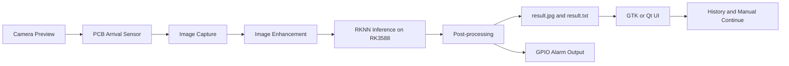
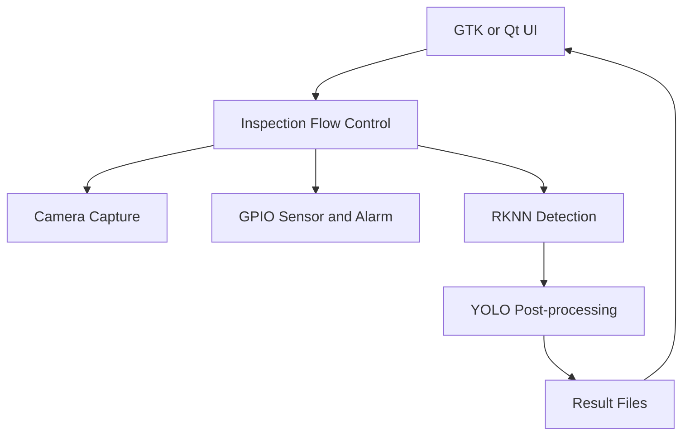

# 基于 RK3588 的 PCB 缺陷 YOLO 智能检测系统

English name: PCB Defect YOLO Intelligent Inspection System on RK3588

本项目是一个面向 PCB 裸板缺陷检测的边缘 AI 工程，包含 YOLOv11-P2 模型配置、训练脚本、ONNX 导出、RKNN 转换、RK3588 端推理、GPIO 控制、摄像头预览/拍照和图形界面源码。

This project is an edge AI inspection system for bare PCB defect detection. It provides YOLOv11-P2 model configuration, training scripts, ONNX export, RKNN conversion, RK3588 inference, GPIO control, camera preview/capture, and desktop UI source code.

本仓库只包含主要工程代码。数据集、企业图片、训练权重、ONNX 模型、RKNN 模型、日志和运行结果不提交到仓库。你提供的 `best.onnx` 可作为本地 RKNN 转换输入使用，但不会打包或上传。

This repository contains source code only. Datasets, business images, trained weights, ONNX models, RKNN models, logs, and runtime outputs are not committed. The provided `best.onnx` can be used locally as the RKNN conversion input, but it is not packaged or uploaded.

## 项目简介 / Project Introduction

系统用于在 RK3588 开发板上完成 PCB 缺陷检测闭环：UI 预览摄像头画面，光电传感器触发拍照，RKNN 模型完成缺陷检测，UI 显示结果，GPIO 输出可用于报警。

The system runs a complete PCB inspection loop on RK3588: the UI previews camera frames, the photoelectric sensor triggers capture, RKNN inference detects defects, the UI displays results, and GPIO output can drive an alarm.

当前检测类别 / Current classes:

- `Mouse_bite`
- `Open_circuit`
- `Short`
- `Spur`
- `Spurious_copper`

检测数量和置信度均来自模型推理与标准后处理结果。

Detection counts and confidence values come from model inference and standard post-processing.

## 功能介绍 / Features

- YOLOv11-P2 PCB 小目标缺陷检测模型配置。
- YOLO 格式数据集配置模板。
- 模型训练与单图预测脚本。
- PyTorch 权重到 ONNX 的导出脚本。
- ONNX 到 RKNN 的转换脚本。
- RK3588 端 RKNNLite 推理脚本。
- 标准置信度过滤、NMS、结果图绘制和四行结果文本输出。
- GPIO 输入/输出控制示例。
- GTK4 + Vala 图形界面源码。
- Qt/C++ 参考界面源码。
- 数据集、图片、模型二进制和日志全部通过 `.gitignore` 排除。

English:

- YOLOv11-P2 model configuration for small PCB defects.
- YOLO-format dataset template.
- Training and single-image prediction scripts.
- PyTorch-to-ONNX export script.
- ONNX-to-RKNN conversion script.
- RKNNLite inference script for RK3588.
- Standard confidence filtering, NMS, result drawing, and four-line result text output.
- GPIO input/output helper.
- GTK4 + Vala desktop UI source.
- Qt/C++ reference UI source.
- Datasets, images, model binaries, and logs are excluded by `.gitignore`.

## 系统架构 / Architecture



软件分层 / Software layers:



## 项目目录 / Project Structure

```text
.
|-- configs/
|   |-- pcb_dataset.yaml
|   |-- deployment/
|   |   |-- photo.txt
|   |   `-- rknn_runtime.yaml
|   `-- models/
|       `-- yolo11n-p2-pcb.yaml
|-- docs/
|   |-- DATASET.md
|   |-- MODEL.md
|   `-- RKNN_DEPLOYMENT.md
|-- examples/
|   `-- README.md
|-- models/
|   `-- README.md
|-- src/
|   |-- export/
|   |-- gpio/
|   |-- rknn/
|   `-- training/
|-- ui/
|   |-- gtk/
|   `-- qt/
|-- CHANGELOG.md
|-- CODE_OF_CONDUCT.md
|-- CONTRIBUTING.md
|-- SECURITY.md
|-- example_dataset.yaml
|-- LICENSE
|-- README.md
|-- requirements.txt
`-- .gitignore
```

## 环境要求 / Requirements

Python:

- Python 3.10+
- PyTorch
- Ultralytics YOLO
- OpenCV
- NumPy
- PyYAML

RKNN:

- RKNN Toolkit 2 for model conversion.
- RKNNLite runtime for RK3588 deployment.

UI:

- GTK4, Vala, Meson, Ninja for `ui/gtk`.
- Qt 6 and CMake for `ui/qt`.

## 安装方法 / Installation

```bash
git clone <repository_url>
cd pcb-defect-yolo-rk3588
python -m venv .venv
source .venv/bin/activate
pip install -r requirements.txt
```

RKNN Toolkit 2 和 RKNNLite runtime 请根据 Rockchip 官方 SDK 或开发板厂商文档安装。

Install RKNN Toolkit 2 and RKNNLite runtime according to the Rockchip SDK or your board vendor documentation.

## 数据集准备 / Dataset

本仓库不提供数据集。请将数据集放在仓库外部，并使用 YOLO 检测格式。

This repository does not provide datasets. Place datasets outside the repository in YOLO detection format.

推荐结构 / Recommended layout:

```text
<dataset_root>/
  images/
    train/
    val/
    test/
  labels/
    train/
    val/
    test/
```

示例配置 / Example configuration:

```text
example_dataset.yaml
configs/pcb_dataset.yaml
```

更多说明见 / See:

```text
docs/DATASET.md
```

## 模型训练 / Training

```bash
python src/training/train_p2.py \
  --model configs/models/yolo11n-p2-pcb.yaml \
  --data configs/pcb_dataset.yaml \
  --weights yolo11n.pt \
  --epochs 100 \
  --imgsz 640 \
  --batch 16
```

单图预测 / Single-image prediction:

```bash
python src/training/predict_image.py \
  --weights <project_root>/weights/best.pt \
  --image <project_root>/samples/pcb.jpg \
  --output <project_root>/results/result_detect.jpg
```

## ONNX 导出 / Export

```bash
python src/export/export_onnx.py \
  --weights <project_root>/weights/best.pt \
  --output <project_root>/export \
  --imgsz 640 \
  --opset 12
```

如果已经有本地 ONNX 文件，可将其放到：

If a local ONNX model already exists, place it at:

```text
<project_root>/export/best.onnx
```

## RKNN 转换 / RKNN Conversion

```bash
python src/export/onnx_to_rknn.py \
  --onnx <project_root>/export/best.onnx \
  --output <project_root>/models/best-rk3588.rknn \
  --target rk3588
```

模型二进制文件只在本地使用，不提交到仓库。

Model binaries are used locally only and are not committed.

## RK3588 部署 / Deployment

在 RK3588 上运行推理：

Run inference on RK3588:

```bash
python src/rknn/pcb_detect.py \
  --model <project_root>/models/best-rk3588.rknn \
  --image <project_root>/samples/pcb.jpg \
  --time_file <project_root>/runtime/capture_time.txt \
  --output_dir <project_root>/runtime/output \
  --conf 0.25
```

输出 / Outputs:

```text
runtime/output/result.jpg
runtime/output/result.txt
```

`result.txt` 格式 / format:

```text
YES or NO
defect_count
defect_type confidence, ...
detection_time
```

## GPIO 控制 / GPIO

GPIO 示例脚本：

GPIO helper:

```bash
python src/gpio/gpio_control.py --gpio 105 --direction in
python src/gpio/gpio_control.py --gpio 103 --direction out --value 1 --hold-ms 3000
```

运行前请根据实际开发板接线修改：

Adjust the following file for your board wiring:

```text
configs/deployment/rknn_runtime.yaml
```

## UI 界面 / GTK and Qt UI

### GTK4 + Vala

GTK UI 位于 `ui/gtk`，是开发板端桌面 UI 主工程。

The GTK UI is in `ui/gtk` and is the main desktop UI project for the board.

```bash
sudo apt install valac meson ninja-build libgtk-4-dev libjson-glib-dev libgdk-pixbuf-2.0-dev
cd ui/gtk
meson setup build
ninja -C build
./build/pcb-inspector-gtk
```

摄像头预览命令模板 / Camera preview template:

```text
configs/deployment/photo.txt
```

### Qt/C++

Qt 参考界面位于 `ui/qt`。

The Qt reference UI is in `ui/qt`.

```bash
cd ui/qt
cmake -S . -B build
cmake --build build
```

## 运行效果 / Results

运行后系统会生成：

Runtime outputs:

```text
runtime/output/result.jpg
runtime/output/result.txt
```

由于本仓库不上传企业图片、采集图片或检测结果图片，README 不展示真实检测图片。用户可以在本地运行后查看 `runtime/output/result.jpg`。

This repository does not upload business images, captured images, or result images. After local deployment, users can view `runtime/output/result.jpg`.

## TODO

- Add public demo images that are safe to redistribute.
- Add automated unit tests for post-processing.
- Add CI checks for Python syntax and repository hygiene.
- Add a detailed wiring diagram for a reference RK3588 board.
- Add packaging scripts for board-side deployment.

## License

本项目采用 MIT License，详见 `LICENSE`。

This project is released under the MIT License. See `LICENSE`.

Ultralytics YOLO and Rockchip RKNN packages are third-party dependencies and follow their own licenses. This repository does not vendor the Ultralytics source tree and does not distribute model binaries.
